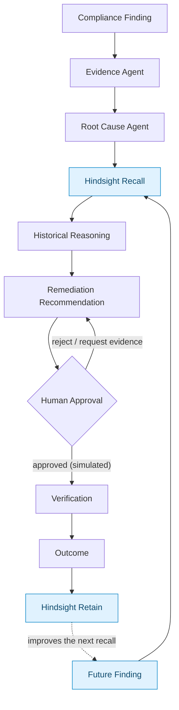

# REMEDY

**AI Compliance Remediation Memory Agent.**

> Don't just find the failure. Remember what happened after the fix.

REMEDY remembers whether a previous remediation attempt actually worked — so the next time the
same control fails, the recommendation is different.

---

## Problem

Compliance findings come back. Not because the team is careless, but because the *fix* was
wrong, and the record of that is scattered across a ticket that nobody reads, an audit PDF, and
somebody's memory.

Today's tooling has two failure modes:

- **It answers the finding in front of it.** The same finding produces the same textbook
  recommendation forever, including after that exact recommendation was applied, verified,
  passed — and then failed again 43 days later.
- **It can't show its work.** When it does change its mind, nobody can say which prior case
  drove the change, what that case's outcome was, or why it should be trusted.

The result is an organisation that keeps re-implementing fixes it has already watched fail, and
auditors who can't trace a recommendation back to any lived experience.

## Solution

REMEDY puts a persistent memory layer in the middle of the remediation workflow instead of
beside it.

A security/compliance engineer opens a finding. REMEDY gathers the evidence, forms a root-cause
hypothesis, and then **recalls what the organisation already knows about this class of problem**
before recommending anything. It shows the stateless answer and the memory-influenced answer side
by side, names the historical cases it used, their outcomes and their lessons, flags any point
where history and current evidence disagree, and stops for a human approval before anything is
simulated. The result of that remediation — success, partial, failure, recurrence — is written
back, which is what changes the answer the *next* time.

The claim the product exists to prove:

> **Same current problem + different memory = different recommendation.**
> One finding, run three ways, produces recommendation **A** with no history, **B** once history
> shows the textbook fix already failed here, and **A ≠ B**.

## Why Hindsight

Hindsight is the actual persistent memory layer — not an array, a JSON blob, a fake vector
search, or a cache that gets rebuilt. Every retained case is extracted into facts (findings,
root causes, remediations, verifications, outcomes, recurrences, lessons) by Hindsight itself and
read back the same way.

| Requirement | How Hindsight is used |
|---|---|
| Persistent, not per-request | Cases survive restarts; the bank holds 18 seeded cases / 300+ facts across 7 lifecycle stages |
| History can change the answer | Recall feeds the reasoning step *before* the recommendation is derived |
| Never fabricate history | `historicalMemoryAvailable: false` when the server is down — the UI says "Historical memory temporarily unavailable", never "no memories exist" |
| Distinguish "no match" from "no history" | `empty` and `unavailable` are separate statuses with separate copy |
| Explainable without chain-of-thought | The explainability panel cites case ids, outcomes, lessons and timestamps — never a model's reasoning trace |
| Conflict handling | Historical claims that disagree with current evidence surface as conflicts requiring human verification; memory is never blindly trusted |
| The loop actually closes | Outcome retention writes to Hindsight and is verifiable on the Memory Inspector and in Demo Mode step 11 |

SQLite is used for **application state only** — findings, evidence, analyses, remediations,
approvals, outcomes, run audit. No historical knowledge lives in it.

## Architecture



**Determinism and honesty rules baked into the flow:**

- The baseline (stateless) recommendation is computed on every run even when memory is available,
  so the A/B contrast is real rather than asserted.
- Recall runs five concurrent query arms and merges them; a partial arrival keeps the memories
  that did arrive rather than discarding them because a sibling query failed.
- LLM output is parsed and Zod-validated as structured data. **Nothing the model emits is ever
  executed.**
- Remediation is **simulated**. A human approval gate sits between every recommendation and every
  simulated change; no auto-execution path exists.

---

## Product surfaces

| Route | What it shows |
|---|---|
| `/` | Dashboard — open/recurring findings, remediation outcomes, memory-influenced findings, systemic issues, and the Memory Impact card, all computed from real rows |
| `/findings` | Findings table with severity, recurrence, status and memory column |
| `/findings/[id]` | The 10-section investigation record: summary, evidence, root cause, historical memory, recommendation, why, human approval, verification, outcome, memory update |
| `/investigate` | Same experience with a finding selector — the shared workflow, never a second copy |
| `/memory` | Memory Inspector — every retained fact by category, with source, case id, outcome, recurrence, lesson and relative relevance |
| `/remediations` | Lifecycle & outcomes across every proposed change |
| `/demo` | Deterministic 12-step walkthrough with a progress indicator |

**The hero panel — "Don't Repeat a Failed Fix"** shows the recurring-finding evidence chain:
similarity to the previous occurrence, its root cause, its remediation, its outcome, time-to-recurrence
(e.g. *43 days*), the historical lesson, and the changed current recommendation — each field
sourced from a recalled case id.

## Quick start

```powershell
npm install

# terminal 1 — keep it running; the server is foreground-only
npm run hindsight:start      # local Hindsight on :8888

# terminal 2
npm run seed                 # 18 synthetic historical cases -> Hindsight
npm run dev                  # http://localhost:3000
```

Then open `/demo` for the guided walkthrough, or `/investigate` to run the workflow yourself.
**Load sample findings** from the dashboard the first time (they go through the real
`POST /api/findings`).

Requires [Ollama](https://ollama.com) with `gemma3:4b` pulled (`ollama pull gemma3:4b`).
Everything runs locally — no API keys, no cloud, no credentials.

## Verification

```powershell
npm run lint                 # eslint
npm run typecheck            # tsc --noEmit
npm test                     # unit — offline, always passes
npm run test:hindsight       # live Hindsight suite (self-skips if the server is down)
npm run test:all             # both
npm run verify:memory        # real retain -> recall round trip
npm run diagnose             # the A vs B comparison, printed side by side
```

`npm test` never touches the network. Hindsight tests are tagged `hindsight` and skip with a
clear message when the server is unreachable.

## Scope

One persona, one workflow: recurring finding → historical memory → remediation recommendation.

All historical cases are synthetic. Out of scope (plan §13): multiple personas, real IAM/HR/cloud
integrations, document RAG, audit summarisation, production auth.

## Docs

| File | What it is |
|---|---|
| `IMPLEMENTATION_PLAN.md` | Phase 1 deliverable — recon, architecture, data model, API, testing strategy |
| `PART1_STATUS.md` | What was built in Phase 1, verification evidence, known limitations, exact commands |

## Layout

```
src/lib/memory/     Hindsight choke point — retain, recall, inspection, failure handling
src/lib/agent/      pipeline, historical case assembly, recommendation, conflict detection
src/lib/dashboard/  pure rollup arithmetic — every dashboard number derives from a row
src/lib/seed/       18 synthetic cases across 7 lifecycle stages
src/app/api/        findings, analyze, approval, outcome, memories, dashboard, status, seed, reset
src/app/            dashboard, findings, investigate, memory, remediations, demo
tests/unit/         hermetic, no network
tests/hindsight/    live server, tagged `hindsight`
scripts/            hindsight-start, seed, verify:memory, diagnose
```
